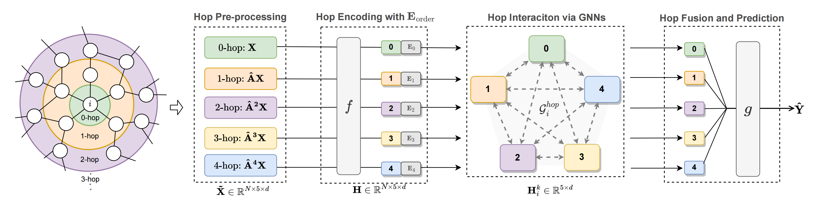

## hopGNN
### Paper
- From Node Interaction to Hop Interaction: New Effective and Scalable Graph Learning Paradigm, Jian Pu, Fudan University. (CVPR 2023)
- https://arxiv.org/abs/2211.11761
  
### Framework

### Methods
- Input: $X, A$
- step 1: build_hop  
$$\widetilde{X} = [X_p^0;X_p^1;...;X_p^L], X_p^l = \hat{A}^lX, $$
where $\hat{A} = D^{-\frac{1}{2}}AD^{-\frac{1}{2}}$ and $\widetilde{X} \in \mathbb{R}^{N \times hop \times d_{in}}.$

- step 2: hop_embedding  
$$H^0 = f(\widetilde{X}) = LayerNorm(\widetilde{X}W + E_{order}),$$
where $E_{order} \in \mathbb{R}^{1 \times hop \times d}$ and $W \in \mathbb{R}^{d_{in} \times d}.$

- step 3: hop_encoding  
For $k$-th layer:
$$H^{k} = LayerNorm(\sigma(MHSA(H^{k-1})) + H^{k-1}),$$
where $MHSA$ is Multi-headed Self-attention.

- step 4: hop_fusion  
$$Z = LayerNorm(mean(H^{K})), Z \in R^{n \times d}$$

- step 5: hop_prediction  
$$\hat{Y} = ZW_{out}, W_{out} \in \mathbb{R}^{d \times d_{out}}$$
